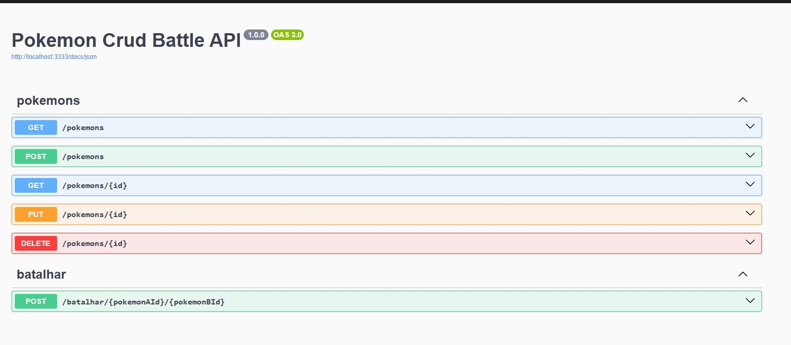

# Pokémon Battle API

API para gerenciar Pokémons, com funcionalidades de cadastro, atualização, exclusão, busca e batalhas entre Pokémons.
Desenvolvido com Node.js, Fastify, Prisma ORM, Docker e Zod para validação.

## Tecnologias

- Node.js
- TypeScript
- Fastify
- Prisma ORM
- Zod (validação)
- Swagger (documentação automática)
- Docker

## Executando o Projeto

### 1. Clonar o repositório

```bash
git clone https://github.com/Renannr/poke-crud-battle.git
cd poke-crud-battle
```

### 2. Subir o projeto

```bash
docker-compose up
```

> Isso irá iniciar a aplicação e as dependências (como banco de dados) automaticamente.

### 3. Acessar a documentação

Com o container rodando, acesse:

```
http://localhost:3333/docs
```



## Endpoints

### Pokémons

- `GET /pokemons` – Lista todos os Pokémons
- `POST /pokemons` – Cria um novo Pokémon
- `PUT /pokemons/:id` – Atualiza o treinador de um Pokémon
- `DELETE /pokemons/:id` – Remove um Pokémon
- `GET /pokemons/:id` – Busca um Pokémon por ID

### Batalha

- `POST /batalhar/:pokemonAId/:pokemonBId`  
  Realiza uma batalha entre dois Pokémons, atualizando seus níveis de acordo com o resultado da batalha.
  Se o perdedor chegar a nível 0, é deletado.

## Regras de Negócio

- Apenas os tipos permitidos: `charizard`, `mewtwo`, `pikachu`
- Ao criar, o Pokémon inicia com nível 1
- Em batalhas:
  - O vencedor ganha +1 nível
  - O perdedor perde -1 nível
  - Se o nível do perdedor for 0, ele é excluído do banco

## Organização

```
.
├── prisma
│   ├── migrations/
│   └── schema.prisma
├── src
│   ├── controllers
│   │   ├── batalhaController.ts
│   │   └── pokemonController.ts
│   ├── lib
│   │   └── prisma.ts
│   ├── routes
│   │   └── routes.ts
│   ├── services
│   │   ├── batalhaService.ts
│   │   └── pokemonService.ts
│   ├── tests
│   ├── index.ts
│   └── types.ts
├── .dockerignore
├── .env
├── .gitignore
├── docker-compose.yml
├── Dockerfile
├── entrypoint.sh
├── package-lock.json
├── package.json
├── README.md
├── tsconfig.json

```
